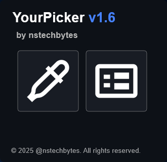
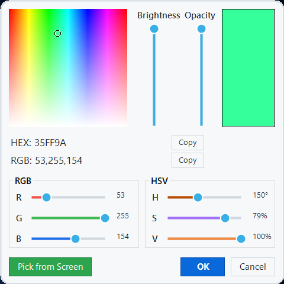
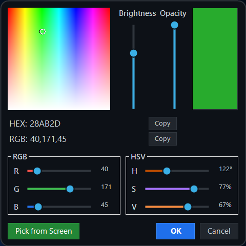

# YourPicker

<div align="center">



[](https://github.com/nstechbytes/YourPicker)
[](https://www.rainmeter.net/)
[](https://www.microsoft.com/windows)
[](LICENSE)
[](https://dotnet.microsoft.com/)

**A modern, feature-rich color picker plugin for Rainmeter with dual-mode selection and dark theme support.**

[Features](#-features) • [Installation](#-installation) • [Usage](#-usage) • [Documentation](#-documentation) • [License](#-license)

</div>

---

## 📋 Table of Contents

- [Features](#-features)
- [Preview](#-preview)
- [Installation](#-installation)
- [Usage](#-usage)
- [Plugin Options](#-plugin-options)
- [Bang Commands](#-bang-commands)
- [Examples](#-examples)
- [Building from Source](#-building-from-source)
- [Contributing](#-contributing)
- [License](#-license)
- [Credits](#-credits)

---

## ✨ Features

- 🎨 **Dual Color Picker Modes**
  - **Color Selector Mode** (`-cp`): Full-featured color picker with HSV/RGB controls
  - **Magnifier Mode** (`-mp`): Quick screen color picker with magnified preview

- 🌓 **Dark Mode Support**
  - Automatic theme switching based on configuration
  - Modern, clean UI design for both light and dark themes

- 🎯 **Advanced Color Controls**
  - Interactive color wheel with hue/saturation selection
  - Brightness and opacity sliders
  - RGB sliders (Red, Green, Blue)
  - HSV sliders (Hue, Saturation, Value)
  - Real-time color preview

- 📋 **Multiple Output Formats**
  - HEX color codes (e.g., `#FF5733`)
  - RGB values (e.g., `255,87,51`)
  - One-click copy to clipboard

- 🔍 **Screen Color Picker**
  - DPI-aware magnifier for precise color selection
  - Square magnifier with real-time preview
  - Keyboard shortcuts (ESC to cancel)

- 🪟 **Modern UI Design**
  - Rounded corners and smooth animations
  - Draggable window interface
  - Double-buffered rendering for flicker-free experience

---

## 🖼️ Preview

### Light Theme


### Dark Theme


### Example Skin


---

## 📦 Installation

### Method 1: Using .rmskin Package (Recommended)

1. Download the latest `YourPicker_v1.6.0.rmskin` from the [Releases](../../releases) page
2. Double-click the `.rmskin` file
3. Rainmeter will automatically install the plugin and example skin

### Method 2: Manual Installation

1. Download the plugin DLL files:
   - For 64-bit Rainmeter: `YourPicker.dll` (x64)
   - For 32-bit Rainmeter: `YourPicker.dll` (x32)

2. Copy the appropriate DLL to your Rainmeter plugins folder:
   ```
   C:\Users\[YourUsername]\Documents\Rainmeter\Plugins\
   ```

3. Refresh Rainmeter or restart the application

---

## 🚀 Usage

### Basic Setup

Add the YourPicker measure to your Rainmeter skin:

```ini
[MeasureYourPicker]
Measure=Plugin
Plugin=YourPicker
ReturnValue=Hex
DarkMode=0
OnFinishAction=[!UpdateMeter *][!Redraw]
```

### Triggering the Color Picker

Use bang commands to open the color picker:

```ini
[ColorPickerButton]
Meter=String
Text="Pick Color"
LeftMouseUpAction=[!CommandMeasure MeasureYourPicker "-cp"]
```

### Getting the Selected Color

Retrieve the color value using the measure:

```ini
[ColorDisplay]
Meter=String
MeasureName=MeasureYourPicker
Text="Selected Color: %1"
```

---

## ⚙️ Plugin Options

Configure the YourPicker measure with the following options:

| Option | Type | Default | Description |
|--------|------|---------|-------------|
| `ReturnValue` | String | `Hex` | Output format for color values. Options: `Hex`, `RGB` |
| `DarkMode` | Integer | `0` | Enable dark theme. `0` = Light mode, `1` = Dark mode |
| `OnFinishAction` | String | *(empty)* | Bangs to execute after color selection is complete |

### Option Details

#### `ReturnValue`
Determines the format of the returned color value:
- **`Hex`**: Returns color in hexadecimal format (e.g., `#FF5733`)
- **`RGB`**: Returns color in RGB format (e.g., `255,87,51`)

#### `DarkMode`
Controls the visual theme of the color picker interface:
- **`0`**: Light theme with bright backgrounds
- **`1`**: Dark theme with dark backgrounds (GitHub-inspired design)

#### `OnFinishAction`
Executes custom Rainmeter bangs after a color is selected. Useful for:
- Updating meters with the new color
- Saving the color to variables
- Triggering other actions in your skin

**Example:**
```ini
OnFinishAction=[!SetVariable MyColor "[MeasureYourPicker]"][!UpdateMeter *][!Redraw]
```

---

## 🎮 Bang Commands

Execute these commands to control the color picker:

| Bang Command | Description | Usage Example |
|--------------|-------------|---------------|
| `[!CommandMeasure MeasureYourPicker "-cp"]` | Opens the **Color Selector** mode with full color controls | `LeftMouseUpAction=[!CommandMeasure MeasureYourPicker "-cp"]` |
| `[!CommandMeasure MeasureYourPicker "-mp"]` | Opens the **Magnifier** mode for quick screen color picking | `LeftMouseUpAction=[!CommandMeasure MeasureYourPicker "-mp"]` |

### Bang Command Details

#### Color Selector Mode (`-cp`)
Opens a comprehensive color picker window featuring:
- Interactive color wheel for hue/saturation selection
- Brightness and opacity sliders
- RGB and HSV manual input sliders
- Real-time color preview
- Copy buttons for HEX and RGB values
- "Pick from Screen" button to switch to magnifier mode

**Best for:** Precise color selection, creating color schemes, manual color adjustments

#### Magnifier Mode (`-mp`)
Opens a screen color picker with:
- DPI-aware magnified preview
- Real-time color tracking under cursor
- Click to select color
- ESC key to cancel

**Best for:** Quick color sampling from screen, matching existing colors, rapid color selection

---

## 📚 Examples

### Example 1: Basic Color Picker

```ini
[Rainmeter]
Update=1000

[Variables]
SelectedColor=#FFFFFF

[MeasureYourPicker]
Measure=Plugin
Plugin=YourPicker
ReturnValue=Hex
OnFinishAction=[!SetVariable SelectedColor "[MeasureYourPicker]"][!UpdateMeter ColorBox][!Redraw]

[PickerButton]
Meter=String
X=10
Y=10
FontSize=12
FontColor=255,255,255,255
SolidColor=0,0,0,255
Padding=10,5,10,5
Text="Open Color Picker"
AntiAlias=1
LeftMouseUpAction=[!CommandMeasure MeasureYourPicker "-cp"]

[ColorBox]
Meter=Shape
X=10
Y=50
Shape=Rectangle 0,0,100,100,5 | Fill Color #SelectedColor# | StrokeWidth 2 | Stroke Color 0,0,0,255
```

### Example 2: Quick Screen Picker

```ini
[MeasureYourPicker]
Measure=Plugin
Plugin=YourPicker
ReturnValue=RGB
DarkMode=1
OnFinishAction=[!Log "Color picked: [MeasureYourPicker]"][!UpdateMeter *][!Redraw]

[MagnifierButton]
Meter=String
Text="Pick from Screen"
LeftMouseUpAction=[!CommandMeasure MeasureYourPicker "-mp"]
```

### Example 3: Dark Mode with Color Display

```ini
[Variables]
MyColor=#000000
MyColorRGB=0,0,0

[MeasureYourPicker]
Measure=Plugin
Plugin=YourPicker
ReturnValue=Hex
DarkMode=1
OnFinishAction=[!SetVariable MyColor "[MeasureYourPicker]"][!UpdateMeter ColorText][!Redraw]

[ColorPickerButton]
Meter=String
Text="Choose Color (Dark Mode)"
LeftMouseUpAction=[!CommandMeasure MeasureYourPicker "-cp"]

[ColorText]
Meter=String
Y=30
Text="Selected: #MyColor#"
FontColor=#MyColor#
```

---

## 🔧 Building from Source

### Prerequisites

- **Visual Studio 2019 or later** (with C# desktop development workload)
- **.NET Framework 4.5 or later**
- **Rainmeter SDK** (included in the `API` folder)
- **PowerShell** (for build script)

### Build Steps

1. **Clone the repository:**
   ```bash
   git clone https://github.com/nstechbytes/YourPicker.git
   cd YourPicker
   ```

2. **Open the solution:**
   ```
   YourPicker.sln
   ```

3. **Build using PowerShell script:**
   ```powershell
   .\Build.ps1
   ```
   This will:
   - Build both x32 and x64 versions
   - Export DLL files
   - Create the `.rmskin` package in the `dist` folder

4. **Manual build (alternative):**
   - Open `YourPicker.sln` in Visual Studio
   - Select configuration: `Release | x64` or `Release | x86`
   - Build → Build Solution (Ctrl+Shift+B)
   - DLL will be in `YourPicker\x64\Release\` or `YourPicker\x86\Release\`

### Project Structure

```
YourPicker/
├── .github/
│   └── preview/          # Preview images
│       ├── dark.png
│       ├── light.png
│       └── example-skin.png
├── API/                  # Rainmeter API files
│   ├── RainmeterAPI.cs
│   └── DllExporter.exe
├── Resources/            # Skin resources
│   ├── Skins/
│   │   └── YourPicker/
│   │       └── Main.ini
│   ├── skin_definition.json
│   └── banner.bmp
├── YourPicker/           # Plugin source code
│   ├── Plugin.cs         # Main plugin entry point
│   ├── YourPicker.cs     # Color picker forms
│   ├── ModernSlider.cs   # Custom slider control
│   ├── ColorUtils.cs     # Color conversion utilities
│   ├── MagnifierForm.cs  # Magnifier window
│   └── AssemblyInfo.cs
├── Build.ps1             # Build automation script
├── LICENSE
└── README.md
```

---

## 🤝 Contributing

Contributions are welcome! Here's how you can help:

1. **Fork the repository**
2. **Create a feature branch** (`git checkout -b feature/AmazingFeature`)
3. **Commit your changes** (`git commit -m 'Add some AmazingFeature'`)
4. **Push to the branch** (`git push origin feature/AmazingFeature`)
5. **Open a Pull Request**

### Development Guidelines

- Follow C# coding conventions
- Test on both x32 and x64 platforms
- Update documentation for new features
- Ensure backward compatibility with Rainmeter 4.5+

---

## 📄 License

This project is licensed under the **MIT License**.
See [LICENSE](LICENSE) file for full details.

---

## 👨‍💻 Credits

**Developed by:** [NS Tech Bytes](https://github.com/nstechbytes) 🇵🇰

**Built with:**
- [Rainmeter](https://www.rainmeter.net/) - Desktop customization platform
- C# / .NET Framework - Plugin development
- Windows Forms - UI framework

---

## 🔗 Links

- **GitHub Repository:** [YourPicker](https://github.com/nstechbytes/YourPicker)
- **Issues & Bug Reports:** [GitHub Issues](https://github.com/nstechbytes/YourPicker/issues)
- **Rainmeter Forum:** [Rainmeter Forums](https://forum.rainmeter.net/)
- **Rainmeter Documentation:** [Rainmeter Docs](https://docs.rainmeter.net/)

---

<div align="center">

**If you find this plugin useful, please consider giving it a ⭐ on GitHub!**

Made with ❤️ by NS Tech Bytes

</div>
